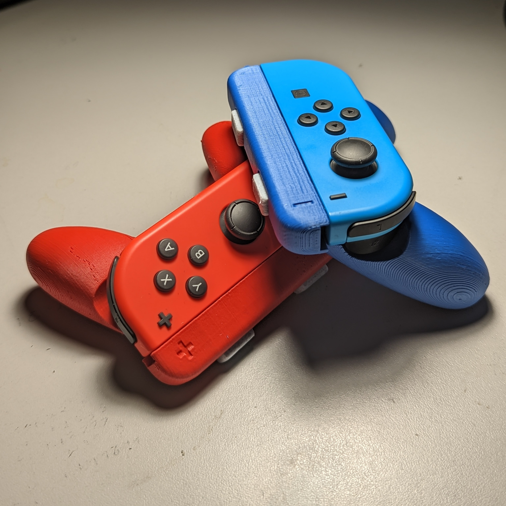

# Grips for Joy-Con - Single
The Grips for Joy-Con - Single are a pair of grips that attach to a pair of Joy-Cons to make them easier to hold and use when they are being used individually. 

## More info at
- [Makers Making Change Project Page](https://makersmakingchange.com/project/grip-joy-con-single/)

## How to Obtain a Grip for Single Joy-Con
### 1. Do it Yourself (DIY) or Do it Together (DIT)

This is an open-source assistive technology, so anyone is free to build it. All of the files and instructions required to build the Grips for Joy-Con - Single are contained within this repository. Refer to the Maker Checklist below.

### 2. Request a build of this device

If you would like to obtain a Grip for Single Joy-Con, you may submit a build request through the [MMC Library Page](https://makersmakingchange.com/project/grip-joy-con-single/). The requestor is responsible for the cost of materials and any shipping.

### 3. How to build this device for someone else

If you have the skills and equipment to build this device, and would like to donate your time to create the switch for someone who needs it, visit the [MMC Maker Wanted](https://makersmakingchange.com/maker-wanted/) section.

## Getting Started

### 1. Read the Makers Checklist

The [Makers Checklist](/Documentation/Grip_Joy_Con_Single_Maker_Checklist_V1.0.pdf)

### 2. Order the Off-The-Shelf Components

The [Bill of Materials](/Documentation/Grip_Joy_Con_Single_BOM.xlsx) lists all of the parts and components required to build the <Device-Name>. The main switch component needs to be ordered online. The rest of the off-the-shelf components are also online or may be available in smaller quantities at your local hardware store or dollar store.

### 3. Print the 3D Printable components

All of the files and individual print files can be in the [/Build_Files/3D_Printing_Files](/Build_Files/3D_Printing_Files/) folder.

### 4. Assemble the Grip for Single Joy Cons

Reference the [Assembly Guide](/Documentation/Grip_Joy_Con_Single_Assembly_Guide_V1.0.pdf) for the tools and steps required to build each portion.

## Files
### Documentation
| Document             | Version | Link |
|----------------------|---------|------|
| Design Rationale     | 1.0     | [Grip_Joy_Con_Single_Design_Rationale](/Documentation/Grip_Joy_Con_Single_Design_Rationale_V1.0.pdf)     |
| Maker Checklist      | 1.0     | [Grip_Joy_Con_Single_Maker_Checklist](/Documentation/Grip_Joy_Con_Single_Maker_Checklist_V1.0.pdf)     |
| Bill of Materials    | 1.0     | [Grip_Joy_Con_Single_Bill_of_Materials](/Documentation/Grip_Joy_Con_Single_BOM_V1.0.xlsx)     |
| 3D Printing Guide    | 1.0     | [Grip_Joy_Con_Single_3D_Printing_Guide](/Documentation/Grip_Joy_Con_Single_3D_Printing_Guide_V1.0.pdf)     |
| Assembly Guide       | 1.0     | [Grip_Joy_Con_Single_Assembly_Guide](/Documentation/Grip_Joy_Con_Single_Assembly_Guide_V1.0.pdf)     |
| User Guide           | 1.0     | [Grip_Joy_Con_Single_User_Guide](/Documentation/Grip_Joy_Con_Single_User_Guide_V1.0.pdf)    |
| Changelog            | 1.0     | [Grip_Joy_Con_Single_Changelog](/Documentation/Grip_Joy_Con_Single_Changelog_V1.0.pdf)     |

### Build Files
 - [3D Printing Files](/Build_Files/3D_Printing_Files)

## Attribution
Designers:
 - [manabun](https://www.thingiverse.com/manabun/designs) on [Thingiverse.com](https://www.thingiverse.com/thing:2769344)

## License
Everything needed or used to design, make, test, or prepare the Grips for Single Joy-Con is licensed under the [Creative Commons - Attribution - Non-Commercial - Share Alike](https://creativecommons.org/licenses/by-nc-sa/4.0/) license. 

Accompanying material such as instruction manuals, videos, and other copyrightable works that are useful but not necessary to design, make, test, or prepare the Grips for Joy-Con - Single are published under a Creative Commons Attribution-ShareAlike 4.0 license https://creativecommons.org/licenses/by-sa/4.0/ (CC BY-SA 4.0).

---
<!-- ABOUT MMC START -->
## About Makers Making Change

Makers Making Change is a program of [Neil Squire](https://www.neilsquire.ca/), a Canadian non-profit that uses technology, knowledge, and passion to empower people with disabilities.

Makers Making Change leverages the capacity of community based Makers, Disability Professionals and Volunteers to develop and deliver affordable Open Source Assistive Technologies.

 - Website: [www.MakersMakingChange.com](https://www.makersmakingchange.com/)
 - GitHub: [makersmakingchange](https://github.com/makersmakingchange)
 - Bluesky: [@makersmakingchange.bsky.social](https://bsky.app/profile/makersmakingchange.bsky.social)
 - Instagram: [@makersmakingchange](https://www.instagram.com/makersmakingchange)
 - Facebook: [makersmakechange](https://www.facebook.com/makersmakechange)
 - LinkedIn: [Neil Squire Society](https://www.linkedin.com/company/neil-squire-society/)
 - Thingiverse: [makersmakingchange](https://www.thingiverse.com/makersmakingchange/about)
 - Printables: [MakersMakingChange](https://www.printables.com/@MakersMakingChange)

### Contact Us
For technical questions, to get involved, or to share your experience we encourage you to [visit our website](https://www.makersmakingchange.com/) or [contact us](https://www.makersmakingchange.com/s/contact).
<!-- ABOUT MMC END -->
